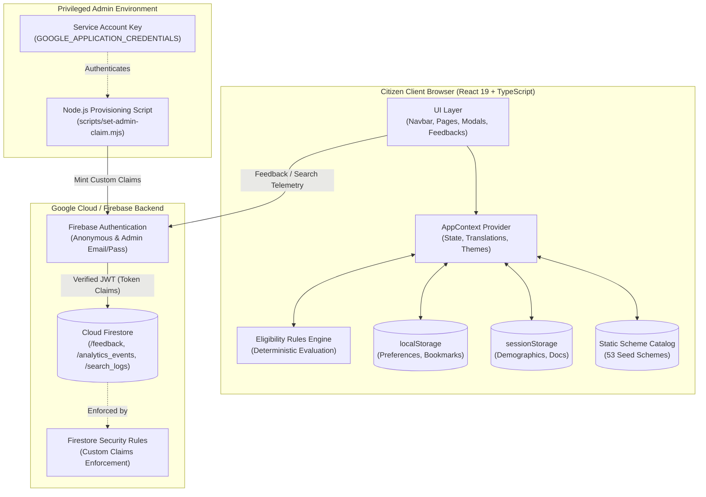
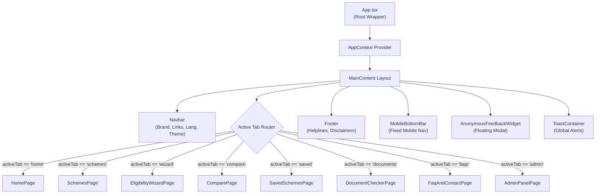
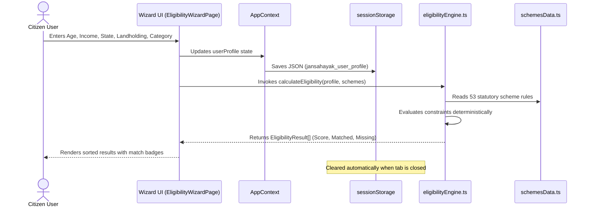
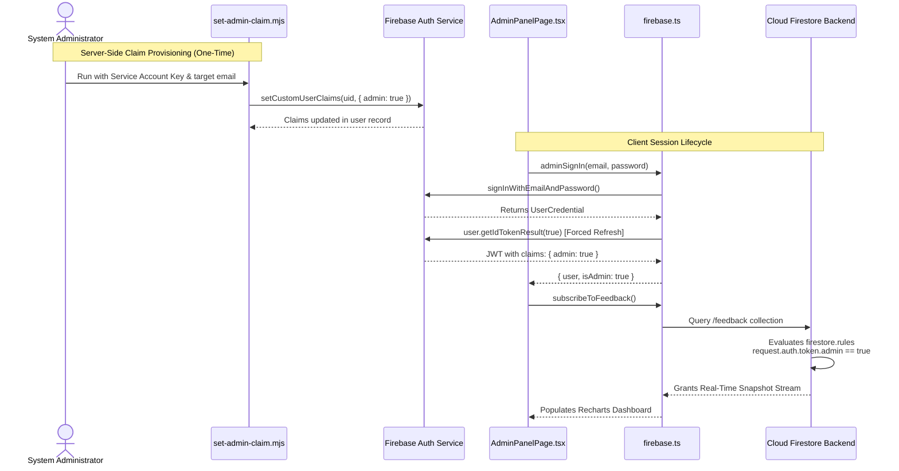

# JanSahayak (जनसहायक) — System Architecture

**Document Version:** 1.0.0
**Project:** JanSahayak College Community Engagement Project (CEP)
**Status:** Baseline Active
**Maintained by:** JanSahayak Engineering Team

---

## 1. High-Level Architecture Overview

JanSahayak is designed as a **client-heavy, privacy-first single-page application (SPA)**. To maximize performance, protect sensitive citizen demographics, and ensure reliability in low-connectivity rural environments, scheme evaluations and document checks execute entirely on the citizen's browser. Centralized cloud services are used solely for anonymous feedback collection, search auditing, and administrative telemetry.



---

## 2. Component Hierarchy & Layout Structure

The application adopts a top-level tab-based router managed within [`src/App.tsx`](./src/App.tsx) and wrapped by the global `AppProvider`:



---

## 3. Citizen Eligibility Data Flow

Demographic data entered during the Eligibility Wizard is kept strictly local to protect citizen privacy:



---

## 4. Authentication & Custom Claims Authorization Flow

JanSahayak enforces genuine administrative authorization via cryptographically signed JWT Custom Claims:



---

## 5. Firestore Collection Schema & Boundaries

```
Firestore Root
├── /feedback/{feedbackId}
│   ├── rating: number (1..5)
│   ├── message: string (1..2000 chars)
│   ├── category: string (optional, max 50 chars)
│   ├── state: string (optional, max 50 chars)
│   ├── page: string (optional, max 50 chars)
│   ├── name: string (optional, max 100 chars)
│   ├── mobile: string (optional, max 20 chars)
│   ├── email: string (optional, max 100 chars)
│   ├── timestamp: string (optional, max 50 chars)
│   └── createdAt: timestamp (serverTimestamp)
│   [Access: Public Create | Admin-Only Read & Delete | No Update]
│
├── /analytics_events/{eventId}
│   ├── eventName: string (1..100 chars)
│   ├── details: string (optional, max 5000 chars)
│   ├── page: string (optional, max 100 chars)
│   ├── query: string (optional, max 200 chars)
│   ├── timestamp: string (optional, max 50 chars)
│   └── createdAt: timestamp (serverTimestamp)
│   [Access: Public Create | Admin-Only Read & Delete | No Update]
│
├── /search_logs/{logId}
│   ├── query: string (1..200 chars)
│   ├── resultsCount: number (0..10000)
│   ├── categoryFilter: string (optional, max 50 chars)
│   ├── timestamp: string (optional, max 50 chars)
│   └── createdAt: timestamp (serverTimestamp)
│   [Access: Public Create | Admin-Only Read & Delete | No Update]
│
└── /{document=**} [Catch-All Default Deny]
    [Access: Blocked unconditionally]
```

---

## 6. External Browser APIs & Integrations

1. **Web Speech API (`webkitSpeechRecognition`)**:
   Used in [`VoiceSearchModal.tsx`](./src/components/VoiceSearchModal.tsx) for hands-free voice input in English, Hindi, and Marathi.
2. **Web Storage API (`sessionStorage` and `localStorage`)**:
   Used for session demographics and persistent user preferences.
3. **HTML5 Canvas / jsPDF**:
   Used in [`pdfGenerator.ts`](./src/utils/pdfGenerator.ts) for client-side rendering and printing of scheme checklists.
4. **Google Firebase Services**:
   Authentication, Cloud Firestore, and Analytics endpoints via official Firebase Web SDK v12.
